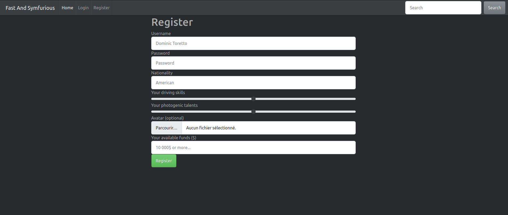

# Fast_and_symfurious
Premier projet symfony, découverte et prise en main de quelques fonctionnalités comme le maker bundle, les migrations, les formulaires ou les rôles (admin & user). 

## L'application
Dans ce projet, le but etait de créer une interface capable gérer des courses de voiture. 
Les pilotes peuvent s'inscrire, une fois inscrit ils peuvent ajouter leur voiture pour participer aux courses. 
Si une voiture est détruite lors d'une course, elle est envoyer au garare et le pilote ne peut plus concourir pour le championnat en cours.
Un championnat est composé de 10 courses et débute quand l'administrateur le souhaite (via un back-office).
Les visiteurs peuvent visualiser les rangs des pilotes participants pendant le championnat en cours via la page /home. Ils peuvent aussi y visualiser les courses effectuées et les courses a venir.

## Visuel
### Page d'inscription

